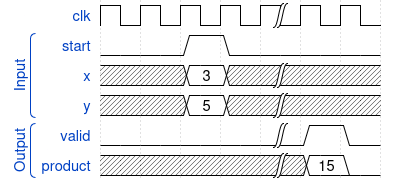
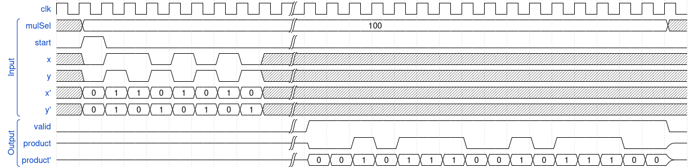

<!---

This file is used to generate your project datasheet. Please fill in the information below and delete any unused
sections.

You can also include images in this folder and reference them in the markdown. Each image must be less than
512 kb in size, and the combined size of all images must be less than 1 MB.
-->

## How it works

This design contains two multipliers for unsigned integers of different bit widths:
* A 3-bit version expecting two inputs in binary representation and a start signal and 
* a 8-bit version that exposes a streaming interface consisting of two input bits, one for each operand, and one start signal

### The general n-bit multiplier

The multiplier has three 1-bit inputs: a `start` signal and one signal for each input `x` and `y`. When `start` is asserted, the current values at `x` and `y` are taken as the least significant bit of the operands of the multiplication. The next $n-1$ cycles, the next bits of the operands should be made available at `x` and `y`. 

When the operands are fully streamed, the multiplier begins its operation for $n\cdot n$ cycles. After the computation is finished, the $2\cdot n$ bits of the product are streamed back; least significant bit first.

At the $(3+n)\cdot n$'th cycle, the full product is stremed back.

Asserting `start` before the multiplication has been fully carried out does not have any effect on the circuit, i.e. it is uninterruptible.

### 3-bit Multiplier
The 3-bit multiplier exposes a human friendly interface by accepting integer values as input, i.e. it wraps the general multiplier as described above. When `start` is asserted, the values at the `x` and `y` inputs are then being streamed into the actual multiplier, taking 3 cycles in total. The multiplier computes the product in 9 cycles and then steams back the 6-bit product in 6 cycles. The result can be seen at the output bit in cycle $18$. The result will remain valid until the next multiplication is started.The wave trace below illustrates this.

### 8-bit Multiplier
The 8-bit multiplier is simply a specialization of the general n-bit multiplier as explained above. The use it, use the bidiretional ports as described in the table in the pinout section below.

The following wave trace shows the multiplication 
$138 \cdot 86 =  (10101010)_2  \cdot (01010110)_2 = 11868 = (0010111001011100)_2$. 
To ease the reading, additional signals (`x'`, `y'`, `product'`) have been defined that show the low/high value as a number.

## How to test

The input to the 3-bit multiplier can conveniently be controlled using the web interface of the motherboard. Alternatively, you can connect the input/ouptut pmods as shown in the table in the pinout section below.

The 8-bit multiplier needs to be controlled and read out via the bidirectional pins as shown in the table in the pinout section below.

## External hardware

The 3-bit multiplier can be controlled via the web interface. For the 8-bit streaming mulitplier, connect to the pins as indicated by the bidirectional column in the table in the pinout section below.
