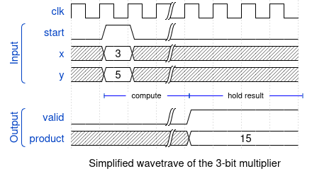

<!---

This file is used to generate your project datasheet. Please fill in the information below and delete any unused
sections.

You can also include images in this folder and reference them in the markdown. Each image must be less than
512 kb in size, and the combined size of all images must be less than 1 MB.
-->

## How it works

This design contains two streaming multipliers. A 3-bit version expecting two input in two's complement representation and a start signal and a 8-bit version that exposes a streaming interface consisting of two input bits, one for each operand, and one start signal.

### The general n-bit multiplier

The multiplier has three 1-bit inputs: a `start` signal and one signal for each input `x` and `y`. When `start` is asserted, 

At the $(3+n)\cdot n$'th cycle, the full product is stremed back

### 3-bit Multiplier
The 3-bit multiplier exposes a human friendly interface by accepting integer values as input. When `start` is asserted, the values at the `x` and `y` inputs are then being streamed into the actual multiplier, taking 3 cycles in total. The multiplier computes the product in 9 cycles and then steams back the 6-bit product in 6 cycles. 

## How to test

Some stuff so that the action does not complain

## External hardware

The 3-bit multiplier can be controlled via the web interface. For the 8-bit streaming mulitplier, connect to the pins as indicated by the bidirectional column in the table in the pinout section below.
